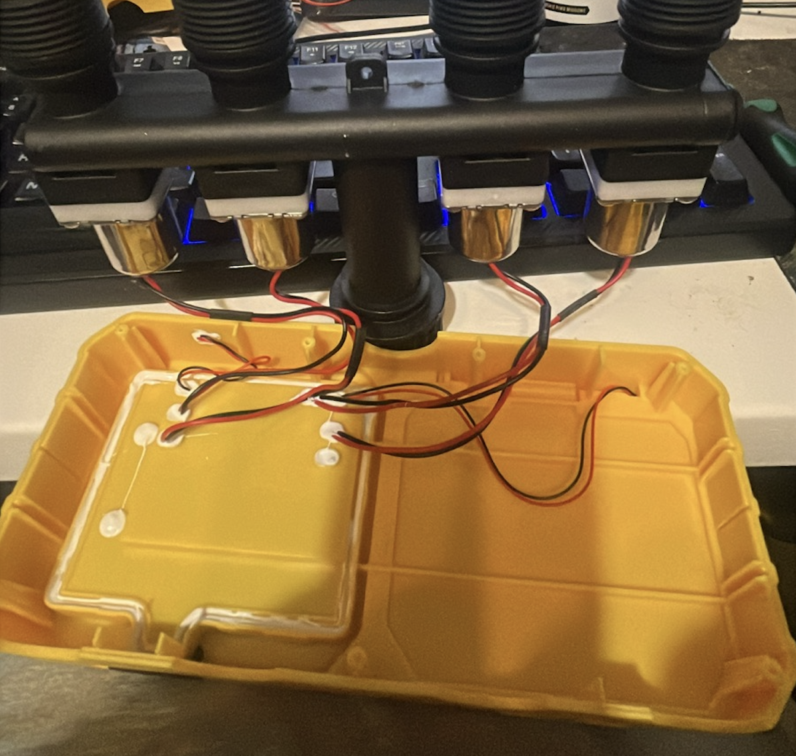
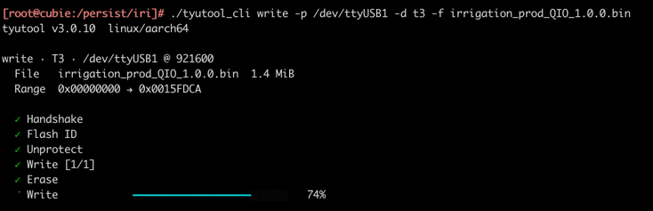
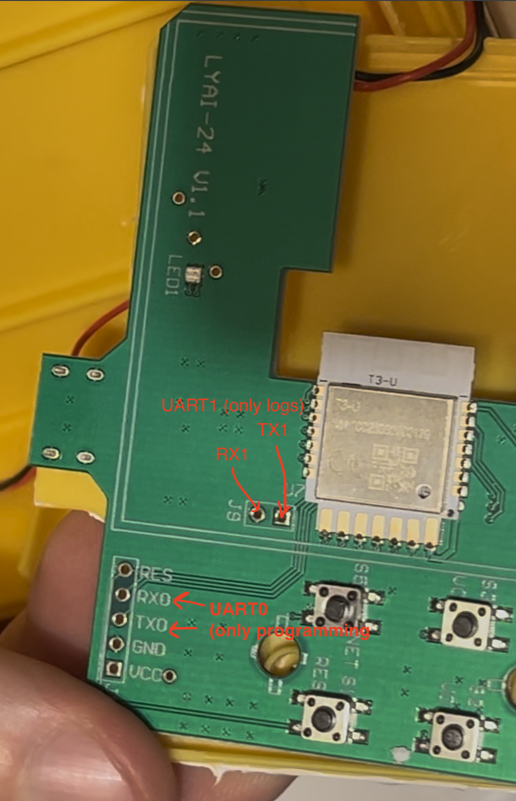

# Yieryi Solar WiFi Smart Water Timer 4 Zone (HH-LYAI-24)



Reverse engineering and custom firmware for the Yieryi 4-zone irrigation controller.

**Goal:** Replace Tuya cloud firmware with local MQTT control.

## Hardware

- **MCU:** Tuya T3-U module (BK7236 SoC, ARM Cortex-M33, 320MHz, 4MB flash, 640KB SRAM)
- **Valve driver:** CD4051B 8-channel analog multiplexer → 4x L9110S H-bridge
- **Power:** Solar + Li-Ion battery, U6 (M7YV) boost to 5V, U5 (BAIQ) LDO 3.3V
- **Sensors:** Rain sensor (analog), battery voltage (ADC)
- **Connectivity:** WiFi 2.4GHz + BLE 5.4

## Pin Mapping

### Tuya T3-U Module Pinout

| Module Pin | GPIO | Function | Silkscreen | Notes |
|------------|------|----------|------------|-------|
| 1 | P14 (GPIO 14) | Red LED | | Confirmed by test |
| 2 | P16 (GPIO 16) | Green LED | | Confirmed by test |
| 3 | P40 (GPIO 40) | Boost 5V enable | U6 (M7YV) | Powers L9110S drivers |
| 4 | P41 (GPIO 41) | USB power detect (INPUT) | U5 (BAIQ) | LOW=USB connected, HIGH=no USB. Original FW deep sleeps when no USB for >50ms |
| 5 | P25 (GPIO 25) | Battery ADC (ADC1) | | Voltage divider R5/R6 (510kΩ) |
| 6 | P1 (GPIO 1) | Button WiFi | S5 | Shared with UART1 RX |
| 7 | P0 (GPIO 0) | UART log TX | | Not connected on PCB |
| 8 | P24 (GPIO 24) | Rain/water sensor | | ADC2, analog |
| 9 | P32 (GPIO 32) | Button D | S2 | |
| 10 | P34 (GPIO 34) | Button B | S6 | |
| 11 | P36 (GPIO 36) | Button A | S4 | |
| 12 | P18 (GPIO 18) | Button C | S3 | |
| 17 | P12 (GPIO 12) | CD4051B address A | | Mux bit 0 |
| 18 | N/A | Reset | S1 | Hardware reset pin |
| 19 | P13 (GPIO 13) | CD4051B address B | | Mux bit 1 |
| 20 | P17 (GPIO 17) | CD4051B address C | | Mux bit 2 |
| 21 | P15 (GPIO 15) | CD4051B COM | | Mux data signal |

### Valve Control Circuit

```
                    CD4051B (8-ch mux)
                   ┌─────────────┐
  GPIO 12 (A) ────┤ A        Y0 ├──── L9110S: Valve 1 open
  GPIO 13 (B) ────┤ B        Y1 ├──── L9110S: Valve 2 close
  GPIO 17 (C) ────┤ C        Y2 ├──── L9110S: Valve 2 open
  GPIO 15 (COM)───┤ COM      Y3 ├──── L9110S: Valve 1 close
  GND ────────────┤ INH      Y4 ├──── L9110S: Valve 3 open
                   │          Y5 ├──── L9110S: Valve 4 close
                   │          Y6 ├──── L9110S: Valve 3 close
                   │          Y7 ├──── L9110S: Valve 4 open
                   └─────────────┘
                         │
  GPIO 40 ──── U6 (boost 5V) ──── L9110S VCC
```

### Mux Channel Mapping (confirmed by hardware test)

| Valve | Open channel | Close channel |
|-------|-------------|---------------|
| 1 | ch 0 | ch 3 |
| 2 | ch 2 | ch 1 |
| 3 | ch 4 | ch 6 |
| 4 | ch 7 | ch 5 |

### Valve Operation (bistable latching valves)

To **open** valve N:
1. Enable boost converter: `GPIO 40 = HIGH`
2. Select mux channel (see table above): set `GPIO 12/13/17` to address
3. Pulse COM: `GPIO 15 = HIGH` for ~1.5s
4. Release: `GPIO 15 = LOW`, `GPIO 40 = LOW`

To **close** valve N:
1. Same as above but use the close channel from the table

### Power Circuit

| Component | Marking | Function | Control |
|-----------|---------|----------|---------|
| U6 | M7YV (SOT-23-5) | Boost converter → 5V | GPIO 40 (enable) |
| U5 | BAIQ (SOT-23-5) | USB power detect | GPIO 41 (INPUT, active LOW) |
| R5, R6 | 510kΩ | Battery voltage divider | GPIO 25 (ADC1) |

### Buttons

| Button | Silkscreen | GPIO | Module Pin |
|--------|------------|------|------------|
| A | S4 | GPIO 36 | P36 (pin 11) |
| B | S6 | GPIO 34 | P34 (pin 10) |
| C | S3 | GPIO 18 | P18 (pin 12) |
| D | S2 | GPIO 32 | P32 (pin 9) |
| WiFi | S5 | GPIO 1 | P1 (pin 6) |
| Reset | S1 | N/A | Hardware reset (pin 18) |

### LEDs, Sensors, Power

| Function | GPIO | Module Pin | Notes |
|----------|------|------------|-------|
| Red LED | GPIO 14 | P14 (pin 1) | |
| Green LED | GPIO 16 | P16 (pin 2) | |
| Rain/water sensor | GPIO 24 | P24 (pin 8) | ADC2, analog |
| Battery voltage | GPIO 25 | P25 (pin 5) | ADC1, divider R5/R6 (510kΩ) |
| Boost 5V enable | GPIO 40 | P40 (pin 3) | Must be HIGH for valves |
| USB power detect | GPIO 41 | P41 (pin 4) | INPUT: LOW=USB connected, HIGH=no USB |
| UART log TX | GPIO 0 | P0 (pin 7) | Not connected on PCB |

## Tuya Cloud Info

- **Product ID (PID):** `dapc1pcplj7rxll`
- **Model:** HH-LYAI-24
- **Category:** `sfkzq` (water valve controller)

### Tuya Datapoints

| DP Code | Type | Range |
|---------|------|-------|
| switch_1 | Boolean | Valve 1 on/off |
| switch_2 | Boolean | Valve 2 on/off |
| switch_3 | Boolean | Valve 3 on/off |
| switch_4 | Boolean | Valve 4 on/off |
| countdown_1 | Integer | Valve 1 timer (0-120 min) |
| countdown_2 | Integer | Valve 2 timer (0-120 min) |
| countdown_3 | Integer | Valve 3 timer (0-120 min) |
| countdown_4 | Integer | Valve 4 timer (0-120 min) |
| battery_percentage | Integer | Battery level (0-100%) |

## Building Custom Firmware

### Prerequisites

- Docker
- TuyaOpen SDK: `git clone https://github.com/tuya/TuyaOpen.git`
- tyutool: `https://github.com/tuya/tyutool`

### Build

```bash
cd yieryi-LYAI-24

# Build Docker image once (x86 required for BK7236 toolchain, includes TuyaOpen SDK)
docker build --platform linux/amd64 -f Dockerfile.build -t tuyaopen-build-x86 .

# Build firmware
docker run --rm --platform linux/amd64 --entrypoint sh \
  -v $(pwd)/firmware_prod:/tuyaopen/apps/irrigation_prod \
  -w /tuyaopen/apps/irrigation_prod \
  tuyaopen-build-x86 -c "
    rm -rf .build && \
    /tuyaopen/.venv/bin/python /tuyaopen/tos.py config choice -c T3.config && \
    /tuyaopen/.venv/bin/python /tuyaopen/tos.py build
  "
```

Output: `firmware_prod/dist/irrigation_prod_1.0.0/irrigation_prod_QIO_1.0.0.bin`

### Flash

```bash
# Backup original firmware first!
tyutool_cli read -d t3 -p /dev/tty.usbserial-210 -s 0x0 -l 0x400000 -f backup.bin

# Flash firmware
tyutool_cli write -d t3 -p /dev/tty.usbserial-210 -f firmware_prod/dist/irrigation_prod_1.0.0/irrigation_prod_QIO_1.0.0.bin

# Restore original firmware
tyutool_cli write -d t3 -p /dev/tty.usbserial-210 -f backup.bin
```



### UART

- **UART0** (TX0=P10, RX0=P11) — **flashing only** via `tyutool_cli`
- **UART1** (TX1=P0 pin 7, RX1=P1 pin 6) — **log output** at 460800 baud
- UART0 and UART1 are different ports — you need two separate connections to flash and read logs simultaneously



## Custom MQTT Firmware

The `firmware_prod/` directory contains production firmware with WiFi + MQTT control.

### MQTT Topics

**Subscribe (control):**
```
irrigation/{1-4}/set    payload: "true" / "false"   Open/close valve 1-4
```

**Publish (status):**
```
irrigation/state        Every 30s
irrigation/availability "online" on connect
```

**State payload:**
```json
{
  "valve_1": false,
  "valve_2": false,
  "valve_3": false,
  "valve_4": false,
  "battery_mv": 4246,
  "battery_percent": 100,
  "rain_sensor": 3261,
  "usb_power": false
}
```

### Configuration

Edit `firmware_prod/src/main.c`:
```c
#define WIFI_SSID   "cubie"
#define WIFI_PASS   "cubie123456789!"
#define MQTT_HOST   "192.168.50.1"
#define MQTT_PORT   1883
```

## Files

| File | Description |
|------|-------------|
| `stock-firmware.bin` | Original factory firmware dump (4MB) |
| `firmware_prod/` | TuyaOpen SDK production MQTT firmware |
| `Dockerfile.build` | Docker build environment for BK7236/T3 (includes TuyaOpen SDK) |

## TODO

- [ ] Button handling (A/B/C/D/WiFi — GPIO 36/34/18/32/1)
- [ ] Auto-stop irrigation on rain detection (rain sensor ADC threshold)
- [ ] Deep sleep / battery power management (`tkl_cpu_sleep_mode_set`)

## References

- [TuyaOpen SDK](https://github.com/tuya/TuyaOpen)
- [TuyaOpen T3](https://github.com/tuya/TuyaOpen-T3)
- [T3-U Module Datasheet](https://developer.tuya.com/en/docs/iot/T3-U-Module-Datasheet?id=Kdd4pzscwf0il)
- [CD4051B Datasheet](https://www.ti.com/product/CD4051B)
- [L9110S Datasheet](https://www.elecrow.com/download/datasheet-l9110.pdf)
- [tyutool](https://github.com/tuya/tyutool)
